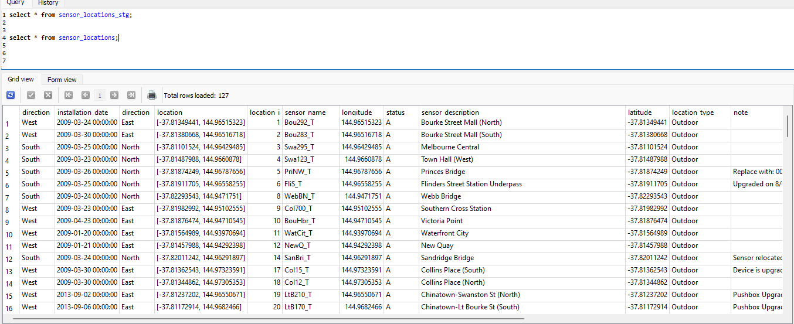

# melbourne-open-data
## pedestrian-counting-system

We are collecting two data sets from Melbourne Open Data API
We will be using API version 1 for this demonstration.
1. Pedestrian Counting System (counts per hour)
2. Pedestrian Counting System - Sensor Locations

### Pedestrian Counting System (counts per hour)
This dataset provides hourly pedestrian counts from 2009 onwards, collected by pedestrian sensor devices across the city. The data is updated monthly and can be used to analyze variations in pedestrian activity throughout the day.

The sensor_id column allows you to merge this dataset with the "Pedestrian Counting System - Sensor Locations" dataset, which includes details on sensor locations, statuses, and directional readings. It's important to account for any changes in sensor locations when analyzing and interpreting pedestrian counts over time.

Key notes about this dataset:

>- If no pedestrians pass under a sensor during an hour, a count of zero will be recorded for that sensor for that hour.
>- Directional readings are not included in this dataset, but we aim to provide them later this year. Currently, directional readings are available in the "Pedestrian Counting System – Past Hour (counts per minute)" dataset.

### Pedestrian Counting System - Sensor Locations

This dataset provides information on the status, location, and directional details of each pedestrian sensor installed across the city. The sensor_id column can be used to merge this dataset with other related datasets.

Since the Pedestrian Counting System was launched in 2009, some sensors have been removed or relocated due to various reasons, such as construction work, while others may be temporarily inactive. These details are provided in the notes column. It is important to consider any changes in sensor locations when analyzing and interpreting historical pedestrian count data.

Sensors are generally mounted under awnings or on street poles to create counting zones on the footpath below. They record bi-directional pedestrian movements 24 hours a day, every day. Sensor locations are chosen based on three criteria: retail and event activity, regular pedestrian use, and pedestrian flow in and out of these areas. The system captures movement data, not images, ensuring no personal information is collected. Recently, new sensors have been installed, with plans for further expansion as part of the city's commitment to the system's growth.

Status field: This field indicates whether the sensor is expected to be active and is updated manually as needed. A sensor marked as active ('A') might still be unavailable in certain situations.

### OPEN DATA API PIPELINE
We are using **Medallion** architecture for this demonstration which includes following layers:
>- **Bronze**: The data sourcing job which connects to the API and collects the data according to the config provided
>- **Silver**: Ingestion Layer This Layer ingests the sourced data into a database (SQLlite) and does required data filtering and cleaning. 
>- **Gold**: Modelled layer This is the basic transformation job which is used to generate insights.

## Data Sourcing Or Bronze Layer:
This job is located here
```
src > sourcing > open_data
```
With the following structure

        ├── config
        │   ├── config.yaml 
        ├── open_data_sourcing.py

The config.yaml file contains the configuration of datasets to be ingested as following:
`````
open_api_url : https://data.melbourne.vic.gov.au/api/records/1.0/search/

open_data:
  pedestrian-counting-system-sensor-locations: 
    lookback : False
    overwrite_sourced : False
    db_load_type : replace

  pedestrian-counting-system-monthly-counts-per-hour :
    lookback : True
    lookback_days : 20
    source_date_column : sensing_date 
    overwrite_sourced : False
    db_load_type : replace
`````
    lookback_days : looks for the data for the last n number of days. 
    overwrite_sourced : [True/False] removes the staging data located in the data/ directory
    db_load_type : [append/replace] loads the data into sqllite db either with append or replace.
    source_date_column: The date column for Change Data Capture. We will be performing SCD type 1 load in ingestion.

**open_data_sourcing.py** calls the API with set params and if there is a need for lookback days it will generate calls for each day and append each record, Finally the staging dataset will be saved in data/ directory.

## Data Ingestion Or Silver Layer:
This job is located here
```
src > ingestion > open_data
```
With the following structure

        ├── config
        │   ├── config.yaml 
        ├── open_data_ingestion.py

The config.yaml file contains the configuration of datasets to be ingested as following:
```
open_data:
  pedestrian-counting-system-sensor-locations: 
    table_name : sensor_locations
    load_type : upsert
    primary_key : location_id
    date_column : installation_date

  pedestrian-counting-system-monthly-counts-per-hour :
    table_name : monthly_counts_per_hour
    load_type : append
    primary_key : id
    date_column : sensing_date
```
>- table_name: the table name used to create or insert data into SQLlite table
>- load_type: upsert when we need to update and insert data, Append when we need to add data.
>- primary_key: required if we are performing an upsert job. required in SQLlite to define primary key when doing on conflict update.
>- date_column: required to keep the latest record while performing upsert job.

The data ingestion job reads data from 
landing_zone folder and creates a sqlite db instance called **ingestion_PROD.db**
Workflow:
>- csv data read into a dataframe.
>- The data will be filtered and duplicates will be removed.
>- The data will be loaded onto the staging table called {table_name}_stg
>- After adding into staging master table is created and primary keys are altered.
>- The Data will be loaded into the master table depending upon the type of load.
you can connect to this DB instance using SQLite studio.
After finishing ingestion it will create tables in the db.
example:


## Gold Layer:
This job is located here
```
src > modelled > open_data
```
With the following structure

        ├── config
        │   ├── config.yaml 
        ├── open_data_ingestion.py

The config.yaml file contains the configuration of datasets to be modelled as following:

```
open_data:
  top_sensor_locations_by_day:
    table_name: top_sensor_locations_by_day
    sql : with all_months as (select c.location_id
                  , l.sensor_description
                  , strftime('%m', sensing_date) AS month
                  , strftime('%d', sensing_date) AS day
                  ,sum (c.direction_1 + c.direction_2) as total_of_count from monthly_counts_per_hour c
          left join sensor_locations l
          on c.location_id = l.location_id
          group by 1,2,3,4
          order by 3,4,5 desc)
          select month,day, location_id, sensor_description, max(total_of_count) as max_count from all_months 
          group by month, day
          order by max_count desc;
```
table_name: The table name of the gold layer table.
sql: The query used to generate this table.

**NOTE** SQLite does not support schemas like redshift therefore I have created a seperate db instance for modelling db. similar to ingestion db called **modelled_PROD.db**

If in case we are not able to connect to the DB, The code will write an csv file mimicing the output. **{NAMESPACE}_{ouptut_table_name}_ref.csv**
example :: open_data_top_sensor_locations_by_day_ref.csv

current model : top_sensor_locations_by_day
 The most used sensor location by day - depends on the amount of data you have sourced, If you want see a larger overview, source more data by changing sourcing job config.

#### Running the pipeline. 
in the terminal run:

```
git clone https://github.com/vipuljad3/melbourne_open_data.git
cd melbourne_open_data/
python3 -m venv venv
source venv/bin/activate
pip install -r requirements.txt
python3 pipeline.py
```


